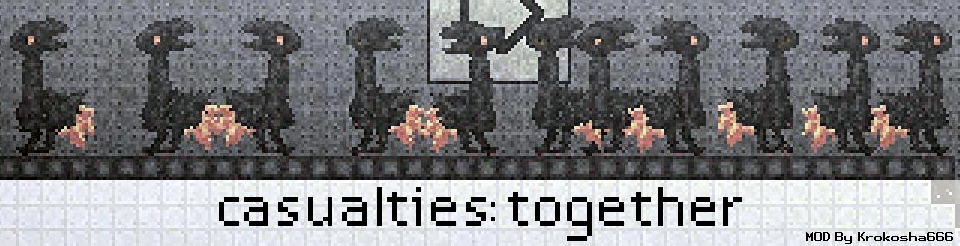
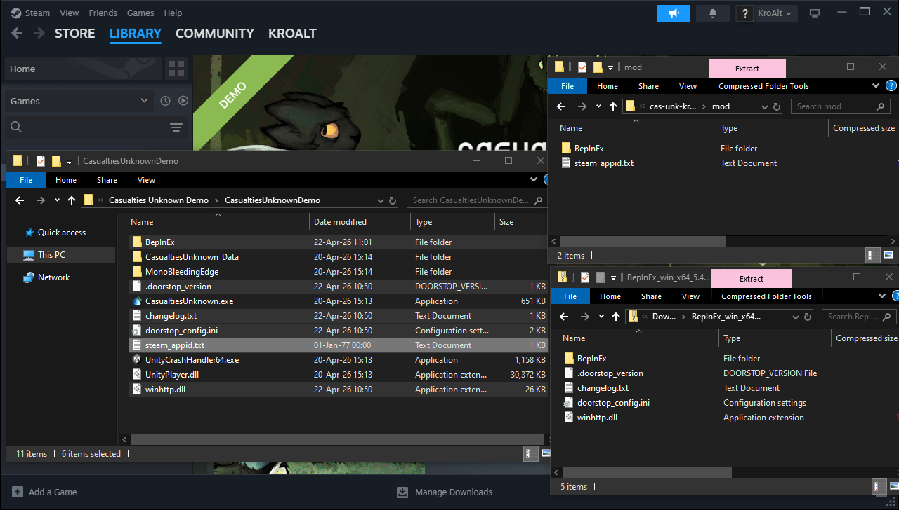

<div align="center">

</div>

<div align="center">

[](https://github.com/Krokosha666/cas-unk-krokosha-multiplayer-coop/releases)
[](https://github.com/Krokosha666/cas-unk-krokosha-multiplayer-coop/releases/latest)
[](https://github.com/Krokosha666/cas-unk-krokosha-multiplayer-coop/releases)
[](https://store.steampowered.com/app/4576510)
</div>


# this is an experemental personal branch attempting to fix desync issues

### Online Multiplayer Co-op mod for game ["Casualties: Unknown"](https://store.steampowered.com/app/4576510)<br/>
Credits are listed in "About" menu inside the mod.


[](https://discord.gg/SA6H7mA6De)   [](https://discord.com/channels/955738554129063947/1470206122844618802)


## support the original creator
[](https://buymeacoffee.com/krokosha666)


<!--


# Install Guide:

### Requirements:
Download Game: https://store.steampowered.com/app/4576510<br/>
Download BepInEx: https://github.com/BepInEx/BepInEx/releases/download/v5.4.23.5/BepInEx_win_x64_5.4.23.5.zip<br/>
Download Co-op Mod: [https://www.nexusmods.com/scavprototype/mods/67](https://www.nexusmods.com/scavprototype/mods/67?tab=files)<br/>

<details><summary>

### Click to show full install guide.
</summary>

1. Download all the prerequisistes ^^^^^^ 

2. Go to the game root directory.
    - In Steam, Right click on the game.
    - Click `Manage > Browse local files`


3. Unzip `BepInEx.zip` into the game root directory.

4. Unzip `KrokMP.zip`, open `mod` folder and move the contents into the game root directory.

5. Now it should look like this 
   


7. Go back to steam and click **Play**.

8. In main menu, multiplayer related buttons should appear.
    - (To go back to singleplayer you need to press the `Deactivate MP Mod` button in `Settings > General`!)

9. (optional) Upvote/Share/Support the mod.

<details>
<summary>FOR LINUX USERS</summary>

1. Add this to launch options `WINEDLLOVERRIDES="winhttp=n,b" %command%`
    - It tells proton to load BepInEx.

</details>
</details>
<br>


    
# Warning:
If it doesn't work: It's a skill issue - Don't whine and try again.
 - Or cry at people in "Casualties: Together" discord server: https://discord.gg/SA6H7mA6De

Make sure to launch the game through Steam Library. For the Steam Lobbies to work.

It's recommended to play at max 4 people because of the poor optimization.<br/>
You need good internet connection and being physically close to your friends for optimal experience.


!!!<br>
IF YOU ENCOUNTER ANY GLITCHES, CRASHES, OTHER ISSUES - BLAME ME AND THE MOD, NOT THE ORIGINAL DEVELOPER OF THE GAME<br>
!!!

To go back to singleplayer you need to press the `Deactivate MP Mod` button in `Settings > General`!


# Features:
Steam Lobbies<br>
Real voice chat with in-game effects.<br/>
Middle Mouse Button to point at a location.<br>
Right click to interact and heal other players.<br> 
Stay close to others to share body temperature.<br>
Spectator mode when dead.<br>
Sleeping is disabled.<br>
Hunger and thirst is slowed down.<br>
Carrying incapacitated players.<br>
Any dead players respawns at next layer.<br>
Unchipped option is individual.<br>
Most of these features can be tweaked in the in-game console.<br>
Also this mod can run as a dedicated server. (its not real headless)<br>

There's no client prediction.<br>
There's no network ownership.<br>
There's no deterministic RNG.<br>
There's no anticheat. <br>
This mod only adds a simple co-op experience to the game.<br>


# FULL LIST OF FEATURES DIFFERENT FROM THE MAIN GAME:

Disabled sleeping. (tied to the rule "EnableSleep" )<br>
Disabled time scale buttons. (don't try re-enable this actually)<br>
Player friendly fire can be enabled with the "FriendlyFire" rule.<br>
Middle mouse click to highlight a location at your cursor, for the other players to see.<br>
Stand close to other players to share body temperature.<br>
Minigames like Keypad are also co-op, where you see others players inputs.<br>

Unchipped is individual. ( rule "UnchippedIsIndividual" )<br>
Text chat and Voice chat are dependent on your characters ability to speak, same distortions apply to your messages.<br>
MP3 Player now is a boombox instead of replacing background music.<br>

Right click on a player to open a player interaction context menu.
 - Inspect health panel and perform any actions.
 - Inspect their inventory and take their items. 
 - Feed any food or any usable item, like AutoPump.

When a player dies, they are put into spectator mode.
 - All dead players respawn after living players reach the next level.
 - (if rule "Permadeath" is true, respawns are disabled)

To continue to the next layer, half of all players must reach the end. 
 - Straggles will get killed if they take too long.
 - Only the Host gets prompted to continue the run.
 - DrillPod works the same, all players must be in the pod to continue.
 - (tweaked by the rule "LayerFinishConditionPlayerPercent")

Slowed down hunger and thirst ( rule "MetabolismMultiplier")<br>
Player health regen and decay is tweaked.
 - Death is much faster if there are no comrades nearby. ( tweaked by the "AdditionalHealthDecay" rule )
 - Health regeneration is boosted. ( tweaked by the "AdditionalHealthRegen" rule)

All these rules can be changed only by the Host by running the command "rule [rule name] [new value]"<br>

You can eat your friends after they died. 
 - The rule "CanAmputateHealthyPlayers" allows you to steal limbs of living players.

Traders first impression reputation is calculated from the prettiest of the bunch.<br>


# How to enable cheats:

The Host must enter this console command:<br>
```rule sv_cheats 1```<br>
**To let Client into server console mode they need "admin" privilege.**<br>
&nbsp;&nbsp;&nbsp;&nbsp;&nbsp;&nbsp;**(Given by "adminpriv [player]" or "adminpriv-password")**

-->


